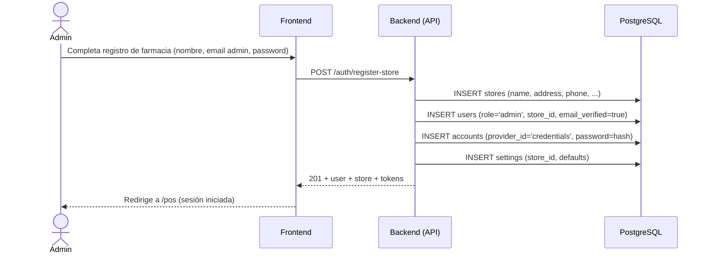

# 1. Registro de Farmacia

**Descripción**: Una nueva farmacia se registra con su administrador inicial.

**Actores**: Administrador (no autenticado), Sistema

**Tablas involucradas**: `stores`, `users`, `accounts`, `settings`

