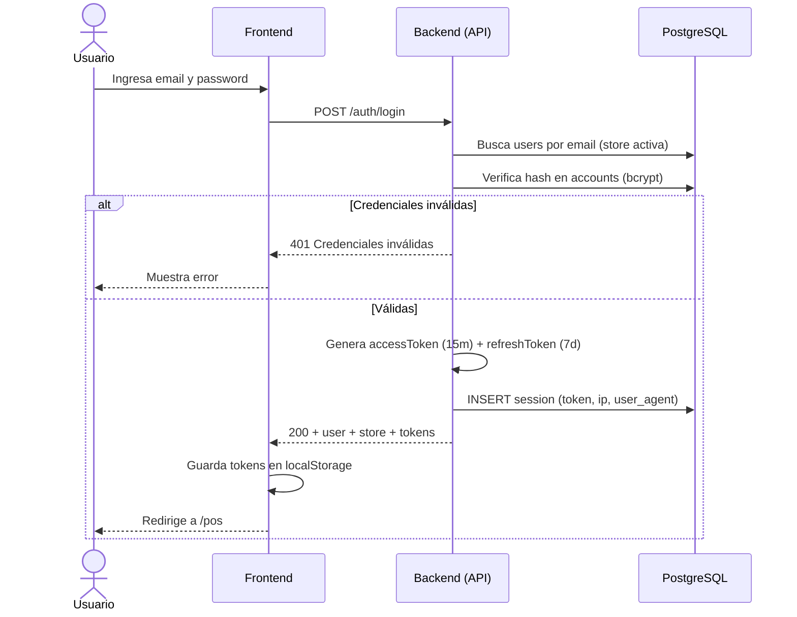

# 2. Inicio de Sesión

**Descripción**: Un usuario inicia sesión y obtiene tokens JWT.

**Actores**: Usuario, Sistema

**Tablas involucradas**: `users`, `accounts`, `session`

```mermaid
sequenceDiagram
    actor U as Usuario
    participant F as Frontend
    participant B as Backend (API)
    participant DB as PostgreSQL

    U->>F: Ingresa email y password
    F->>B: POST /auth/login
    B->>DB: Busca users por email (store activa)
    B->>DB: Verifica hash en accounts (bcrypt)
    alt Credenciales inválidas
        B-->>F: 401 Credenciales inválidas
        F-->>U: Muestra error
    else Válidas
        B->>B: Genera accessToken (15m) + refreshToken (7d)
        B->>DB: INSERT session (token, ip, user_agent)
        B-->>F: 200 + user + store + tokens
        F->>F: Guarda tokens en localStorage
        F-->>U: Redirige a /pos
    end
```
