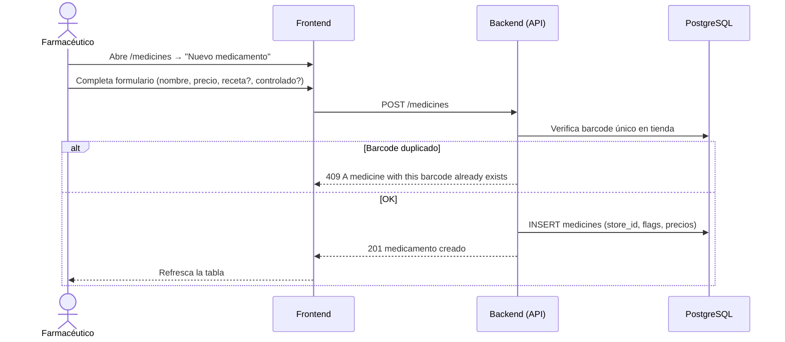

# 3. Gestión de Medicamentos

**Descripción**: El farmacéutico crea o actualiza un medicamento del catálogo.

**Actores**: Farmacéutico, Sistema

**Tablas involucradas**: `medicines`, `categories`, `suppliers`

