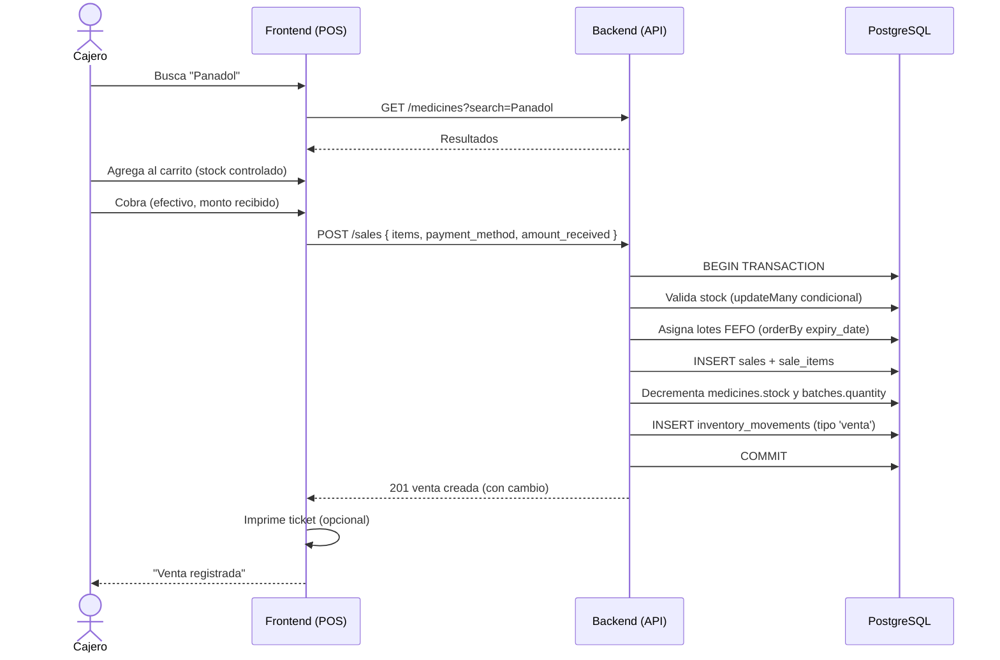

# 4. Venta en POS

**Descripción**: El cajero vende medicamentos sin receta: busca, agrega al carrito y cobra.

**Actores**: Cajero, Cliente, Sistema

**Tablas involucradas**: `sales`, `sale_items`, `batches`, `medicines`, `inventory_movements`

