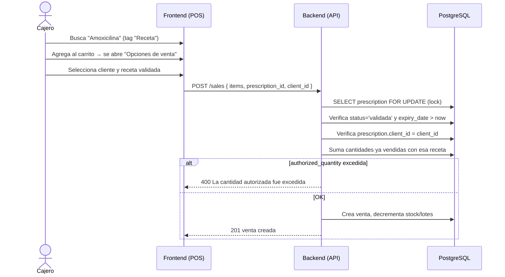

# 5. Venta con Receta

**Descripción**: El cajero vende un medicamento que requiere receta usando una receta validada.

**Actores**: Cajero, Cliente, Sistema

**Tablas involucradas**: `sales`, `prescriptions`, `prescription_items`, `sale_items`, `medicines`

