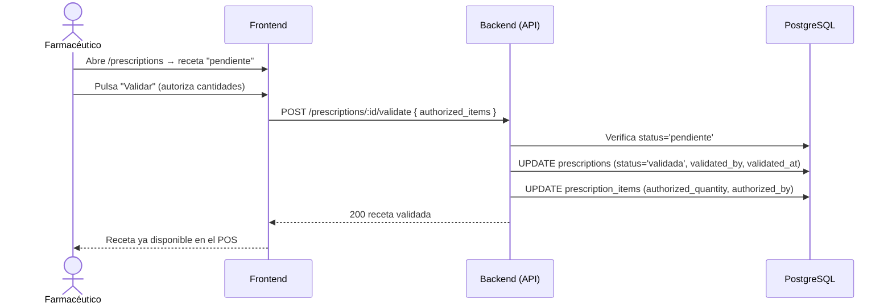

# 6. Validación de Receta

**Descripción**: El farmacéutico valida una receta y autoriza cantidades por medicamento.

**Actores**: Farmacéutico, Sistema

**Tablas involucradas**: `prescriptions`, `prescription_items`

