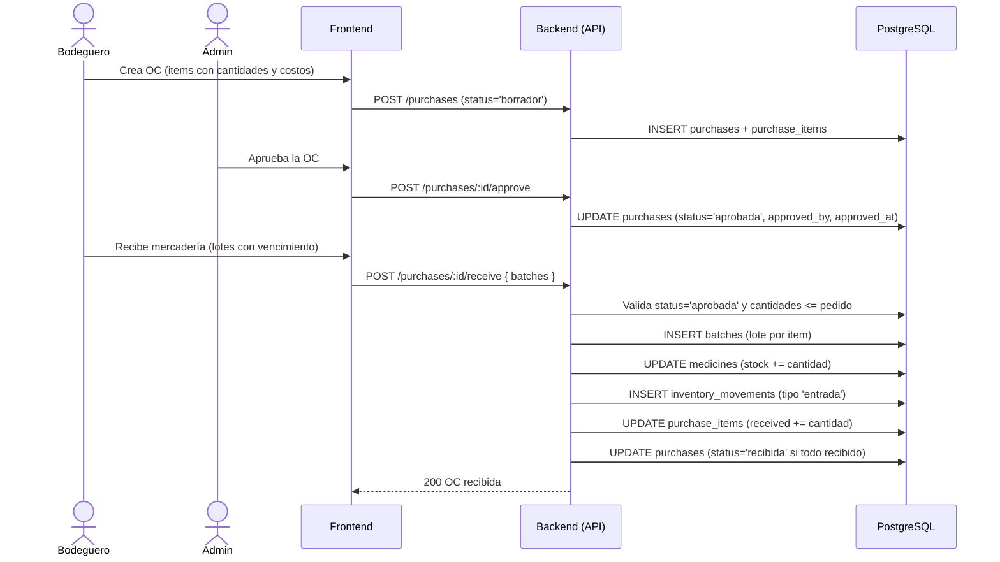

# 7. Orden de Compra y Recepción

**Descripción**: El bodeguero crea una OC, el admin la aprueba y el bodeguero recibe mercadería creando lotes.

**Actores**: Bodeguero, Admin, Sistema

**Tablas involucradas**: `purchases`, `purchase_items`, `batches`, `medicines`, `inventory_movements`

