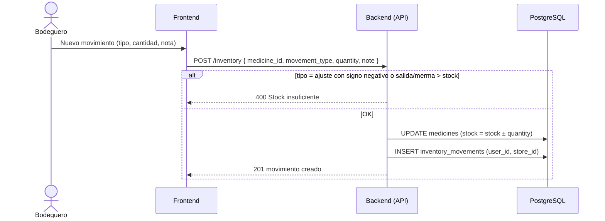

# 9. Movimiento de Inventario

**Descripción**: Se registra un ajuste, merma o salida manual de inventario.

**Actores**: Bodeguero, Sistema

**Tablas involucradas**: `inventory_movements`, `medicines`

