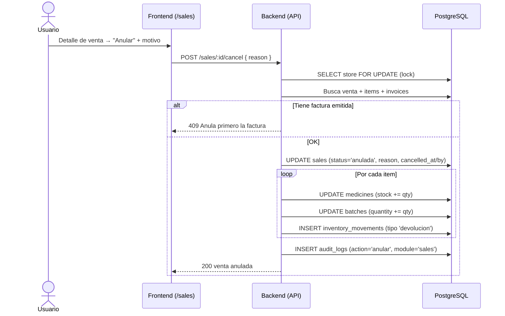

# 10. Anulación de Venta

**Descripción**: Se anula una venta, devolviendo stock a medicamentos y lotes.

**Actores**: Admin/Cajero, Sistema

**Tablas involucradas**: `sales`, `sale_items`, `batches`, `medicines`, `invoices`, `inventory_movements`, `audit_logs`

