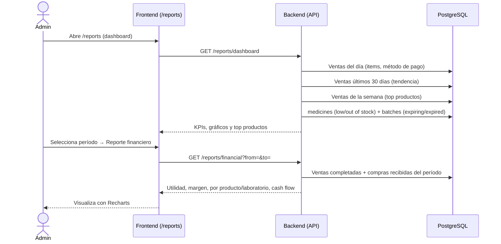

# 12. Reportes Financieros

**Descripción**: El admin consulta el dashboard y el reporte financiero del período.

**Actores**: Admin, Sistema

**Tablas involucradas**: `sales`, `sale_items`, `purchases`, `medicines`, `batches`, `settings`

