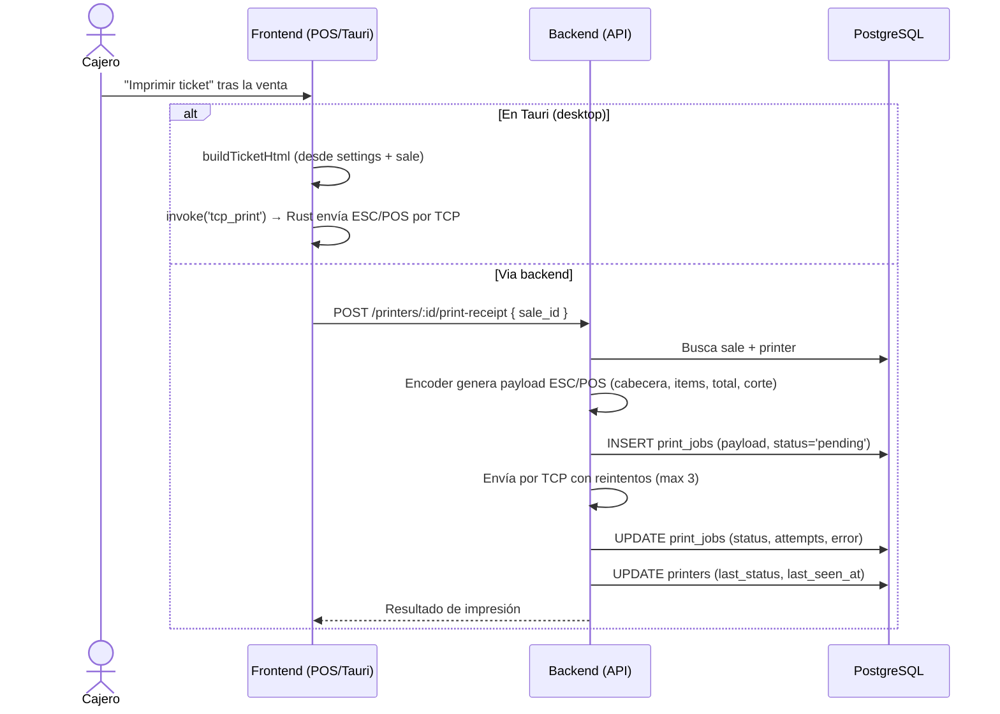

# 13. Impresión de Ticket

**Descripción**: Tras una venta, el cajero imprime el ticket en la impresora térmica.

**Actores**: Cajero, Sistema

**Tablas involucradas**: `print_jobs`, `printers`, `sales`, `settings`

