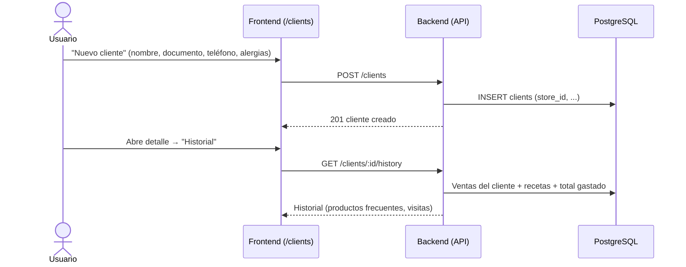

# 14. Gestión de Clientes

**Descripción**: Se registra un cliente y se consulta su historial de compras y recetas.

**Actores**: Cajero/Admin, Sistema

**Tablas involucradas**: `clients`, `sales`, `prescriptions`

