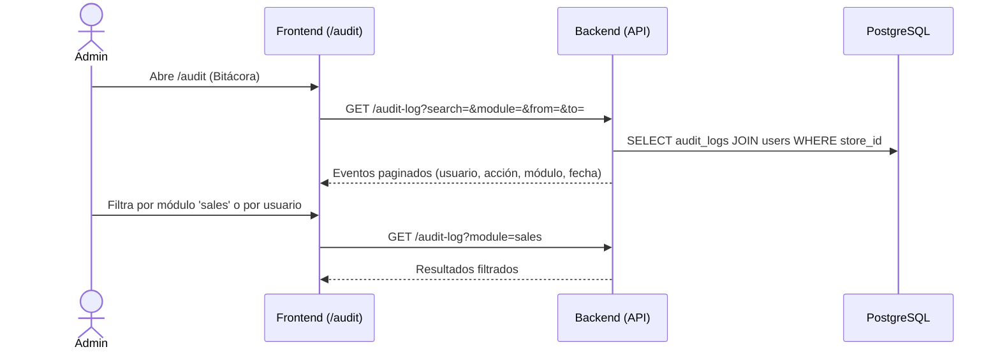

# 15. Auditoría de Acciones

**Descripción**: El admin revisa la bitácora de acciones del sistema.

**Actores**: Admin, Sistema

**Tablas involucradas**: `audit_logs`, `users`

```mermaid
sequenceDiagram
    actor Ad as Admin
    participant UI as Frontend (/audit)
    participant B as Backend (API)
    participant DB as PostgreSQL

    Ad->>UI: Abre /audit (Bitácora)
    UI->>B: GET /audit-log?search=&module=&from=&to=
    B->>DB: SELECT audit_logs JOIN users WHERE store_id
    B-->>UI: Eventos paginados (usuario, acción, módulo, fecha)
    Ad->>UI: Filtra por módulo 'sales' o por usuario
    UI->>B: GET /audit-log?module=sales
    B-->>UI: Resultados filtrados
```
